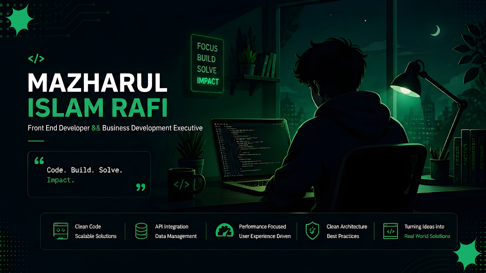

<!-- Banner Header -->


<div align="center">


<!-- Typing SVG -->


<!-- Profile Badges -->
<p>
  
  
  
</p>

</div>

---

## 👨‍💻 About Me

```ts
const rafi = {
  name:       "Mazharul Islam Rafi",
  role:       "Business Development Executive",
  company:    "Softvence Agency",
  location:   "Dhaka, Bangladesh 📍",
  experience: "1+ Year",
  focus:      ["Scalable UI", "Clean Architecture", "Business Analysis"],
  contact:    "mazharulrafi@gmail.com",
};
```

- 🏢 Currently working at **Softvence Agency** (On-site)
- 💡 Passionate about **component architecture & developer experience**
- 🎯 Specialized in **React, Next.js, TypeScript, and dashboard systems**
- 📖 Always sharpening skills — currently on Phitron Batch-8


## Tech Stack

<div align="center">
  
  
  
  
  
  
  
  
  
  
  
</div>


## 📊 GitHub Analytics

<div align="center">
  
</div>

<br/>

<div align="center">
  
  
</div>

<p align="center">
  
</p>
---


## 🌐 Connect With Me

<div align="center">

[](https://www.facebook.com/rafimazharul/) 
[](https://www.instagram.com/rafi_lostinthoughts/?hl=en) 
[](https://www.linkedin.com/in/rafimazharul/)
[](https://github.com/rafimazharul)
[](https://mazharul.bro.bd/)
[](mailto:mazharulrafi@gmail.com)
</div>

---

<div align="center">
  
</div>
